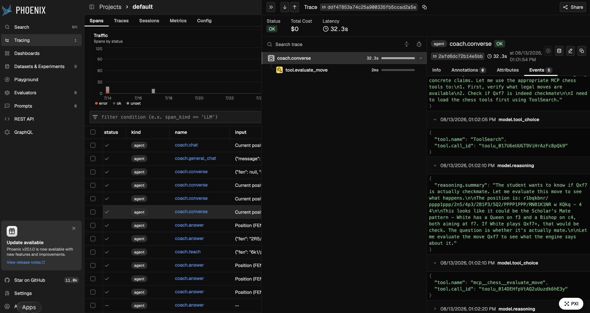

# Chess Coach Agent TUI

An agent harness built for one job: coaching a chess student in the terminal.
Stockfish is the source of chess truth; a Claude Code or Codex agent turns that
truth into a lesson at the student's level.

It is a **local agent, reached through the TUI — not a hosted service**. Everything
runs on your machine: the engine, the traces and the evaluation suite. Deploying it
as a service is deliberately out of scope here and listed in
[Next steps](#next-steps).

## Table of contents

- [Demo](#demo)
- [How the harness works](#how-the-harness-works)
- [Observability](#observability)
- [Datasets](#datasets)
- [Evaluation](#evaluation)
- [Getting started](#getting-started)
  - [Option A: clone and ask an agent](#option-a-clone-and-ask-an-agent)
  - [Option B: install it yourself](#option-b-install-it-yourself)
  - [Start coaching](#start-coaching)
  - [Troubleshooting](#troubleshooting)
- [Development](#development)
- [Next steps](#next-steps)
- [License](#license)

## Demo

The coach solving Morphy's famous mate in two, in the terminal UI:

https://github.com/user-attachments/assets/f7809b0b-b0e2-495c-9a27-6ab5e6f846ca

## How the harness works


It is built orthogonally to the model: the investment goes into chess knowledge,
context, tools and evals — which improve on their own — rather than into rules and
prompt hacks patching today's model weaknesses, so a better model arrives and
leverages the same foundation even more effectively.

The harness turns each coaching request into a bounded, evidence-driven workflow.
It builds the model context from the position, the student's question, the task,
the conversation history, and the requested coaching level, then selects the
appropriate coaching skill.

Inside the agent loop, Claude or Codex observes the available evidence, chooses
an action, calls an allowed chess tool when needed, and evaluates the result before
deciding whether to continue. The loop is limited to eight turns, and its restricted
tool boundary exposes chess operations only — never the shell, web, or filesystem.
Engine analysis is prefetched and memoized so repeated requests for the same
position can reuse the result.

**The tools.** Six in-process capabilities, all deterministic: `analyze_position`
(Stockfish evaluation and principal variation), `probe_tablebase` (exact endgame
results), `opening_lookup` (book theory), `position_features` (an engine-free scan
of checks, captures and loose pieces), `evaluate_move` (centipawn loss of one move
the student is weighing) and `compare_candidates` (rank a shortlist, best first).

**The skills.** Coaching methods live in [`.agents/skills/`](.agents/skills) using
the open Agent Skills convention — `tactics-coach`, `assessment-coach`,
`endgame-coach`, `general-coach` and `interactive-coach`. Each skill declares the
logical capabilities it needs, and the harness grants only that subset for the turn,
so an endgame question cannot reach the candidate-comparison tool it has no use for.

**The providers.** The same provider-neutral skill drives either backend: Claude
receives the tools over an in-process MCP server and calls them itself; Codex
receives the same method with the engine facts computed up front. Stockfish stays
the arbiter in both cases — the agent's contribution is choosing the right evidence
and explaining it faithfully, never inventing an evaluation.

Finally, the harness parses and validates the structured response before the CLI or
TUI presents it to the student. See
[`src/chess_coach/architecture.md`](src/chess_coach/architecture.md) for the layered
design and the dependency rule.

## Observability

The coach emits OpenTelemetry traces for each agent turn and chess-tool call. In
Phoenix, a trace shows the complete span waterfall together with tool choices and
the provider-exposed reasoning summaries that led to the final coaching response:



One span per coaching turn (model, tokens, cost, latency, outcome), one child span
per tool call (the real engine latency and the FEN it saw). Spans are plain OTLP, so
any backend works; the default target is a local, network-free Phoenix at
`http://localhost:6006`:

```bash
uv sync --locked --extra tracing
phoenix serve                      # trace UI + collector
uv run chess-coach coach "<FEN>"   # tracing is on by default
```

Traces are also the raw material for the work in [Next steps](#next-steps): timing
each span is how you find the bottleneck worth parallelising, and reading failed
turns span by span is how you decide what to fix next. See the
[observability guide](src/chess_coach/adapters/observability/observability.md) for
trace contents and configuration.

## Datasets

182 committed goldens plus a separate move-evaluation pool, in deliberately
different shapes — because a coach can be right about the move and useless as a
teacher, and only different datasets expose the difference.

| Dataset | Size | What it asks | How it is graded |
| --- | --- | --- | --- |
| `best_move` | 20 | The strongest move in a tactical position | Deterministic |
| `eval_bucket` | 20 | Who stands better, and by how much | Deterministic |
| `endgame` | 20 | The key technique move *and* the result | Deterministic |
| `deep_line` | 20 | A 3–5 ply continuation with both sides' plans | Deterministic + judge |
| `teaching` | 12 | One live teaching turn, with spoiler control | Judge (rubric) |
| `mistake_diagnosis` | 10 | The missed move, the refutation, the reusable weakness | Judge (rubric) |
| `multi_turn_teaching` | 10 | A hint ladder that reveals only when allowed | Judge (rubric) |
| `conversation` | 50 | The next turn of a stored teacher–student dialogue | Hybrid: policy + judge |
| `general_chat` | 20 | A chess question with no board at all | Judge (key facts) |
| `move_eval` | 42 | "I was thinking about X — is that good?" | Deterministic |

**Sources.** Positions, lessons and student phrasing come from a corpus of chess
books plus high-vote questions on
[Chess Stack Exchange](https://chess.stackexchange.com/):

- Jeremy Silman — *Silman's Complete Endgame Course*
- Jeremy Silman — *The Amateur's Mind*
- Jonathan Rowson — *The Seven Deadly Chess Sins*
- Artur Yusupov — *Build Up Your Chess 1: The Fundamentals*
- Irving Chernev — *Logical Chess: Move by Move* (teacher–student conversations
  and `move_eval`)
- …

Full per-family detail, sourcing notes and the extraction toolchain:
[`evals/README.md`](evals/README.md).

## Evaluation

Grade with code wherever the answer has a ground truth; spend a judge only on what
code cannot see. Four strategies, each used where it is actually valid:

- **Deterministic ground truth** — the move, bucket, endgame result and continuation
  compared against Stockfish, the tablebase or the book. Offline, free, and the gate.
- **No per-example ground truth, still checkable by code** — forbidden claims absent,
  spoiler policy respected, the verdict attributed to the *student's* move; a reply
  that lands on no verdict scores `unclear` rather than in the coach's favour.
- **Facts and key points + LLM as a judge** — prose graded against the golden's
  source-backed key ideas and reference explanation.
- **LLM as a judge with a rubric** — named dimensions (correctness, coverage, context
  awareness, teaching quality, spoiler policy, level fit) with an explicit threshold.
  The judge model is injectable — Claude, or Codex with no API key — criteria unchanged.

Judged metrics are opt-in behind the `judge` marker, so the default run stays
network-free.

> **Recommended practice: keep evaluation out of the agent's reach.**
> If the coach is ever allowed to improve itself against these scores, host the
> evaluation as a separate service or API in its own repository, and expose only
> traces and aggregate scores back to the agent — never the dataset.

Running them:

```bash
uv sync --locked --extra evals --extra tracing         # harness + local Phoenix

# Grade the reference Stockfish oracle: proves the harness, metrics and data.
uv run pytest evals/ -m "not judge"                    # deterministic gate (offline)

# Grade the real coach: run it once to fill the answer cache, then read that cache.
uv run python -m evals.tools.run_agent
COACH_TASK=agent uv run pytest evals/ -m "not judge"

uv run pytest evals/ -m judge                          # judged metrics (needs a key)
uv run python -m evals.tools.run_codex --per-task 3 --label baseline
uv run python -m evals.tools.run_codex_judged --per-task 2 --variant grounded
uv run python -m evals.tools.run_move_eval --out baseline.json
uv run python -m evals.tools.validate_goldens          # re-prove goldens vs Stockfish
uv run python -m evals.tools.report                    # per-task scoreboard
```

`COACH_TASK` selects the system under test: `oracle` (the default) grades a pinned
Stockfish solver, `agent` grades the real coach. A green default run says the
framework is sound, not that the coach is.

Two of those commands are comparisons rather than scores. `run_codex --label` writes a
labelled report so a baseline and a treatment run can be diffed honestly, and
`run_codex_judged --variant naive|grounded` A/Bs the real coach against a bare
"you are a chess coach" prompt — the gap between them is what the harness is worth.

The suite also mirrors into Phoenix as versioned datasets and experiments, which
adds per-example scores and run-to-run comparison in a UI while the pytest gate
stays the source of truth:


```bash
phoenix serve
uv run python -m evals.phoenix.upload            # goldens -> one dataset per task
COACH_TASK=agent uv run python -m evals.phoenix.run
```

## Getting started

macOS and Debian-based Linux are supported; on Windows, use WSL 2 and follow the
Linux instructions.

### Option A: clone and ask an agent

If you already have Claude Code or Codex installed, let it do the setup:

```bash
git clone https://github.com/IGRDA/chess-coach-agent.git
cd chess-coach-agent
claude          # or: codex
```

Then ask:

> Set up this repo end to end and tell me what's missing.

The agent reads this README, installs what is needed, and runs
`uv run chess-coach doctor` to confirm. Skip to
[Start coaching](#start-coaching) when it reports `OK`.

### Option B: install it yourself

**1. System tools.** You need Git,
[uv](https://docs.astral.sh/uv/getting-started/installation/) and Stockfish. `uv`
installs a compatible Python automatically (the project requires 3.11+).

```bash
# macOS (Homebrew)
brew install git uv stockfish

# Ubuntu / Debian / WSL
sudo apt-get update
sudo apt-get install -y ca-certificates curl git stockfish
curl -LsSf https://astral.sh/uv/install.sh | sh
```

Restart the terminal after installing `uv`. If Linux installed Stockfish at
`/usr/games/stockfish` but `command -v stockfish` prints nothing, set its path (add
the export to `~/.profile` to keep it):

```bash
export CHESS_COACH_STOCKFISH_PATH=/usr/games/stockfish
```

**2. The project.** From the repository root:

```bash
uv sync --locked
uv run chess-coach --help
```

All examples use `uv run`, so you never need to activate `.venv` manually.

**3. A coaching provider.** Install one — it writes the explanation, while
Stockfish remains the source of chess truth:

```bash
# Claude Code — https://code.claude.com/docs/en/getting-started
curl -fsSL https://claude.ai/install.sh | bash

# or Codex CLI — https://learn.chatgpt.com/docs/codex/cli
curl -fsSL https://chatgpt.com/codex/install.sh | sh
```

**4. First-time setup.** This saves the provider choice, checks Stockfish, and opens
the login flow when authentication is needed:

```bash
uv run chess-coach setup --provider claude   # or: --provider codex
uv run chess-coach doctor
```

`Provider auth` and `Stockfish` should both report `OK`. Configuration is stored in
`~/.config/chess-coach/config.toml` (or under `$XDG_CONFIG_HOME`).

### Start coaching

```bash
uv run chess-coach tui      # interactive board
uv run chess-coach chat     # terminal chat
```

For a one-shot explanation, pass a position as FEN:

```bash
uv run chess-coach coach \
  "rnbqkbnr/pppppppp/8/8/8/8/PPPPPPPP/RNBQKBNR w KQkq - 0 1" \
  --level beginner
```

Switch providers later with `uv run chess-coach provider use claude` or
`uv run chess-coach provider use codex`.

### Troubleshooting

- `Stockfish: FAIL`: run `command -v stockfish`. If the Linux package installed
  `/usr/games/stockfish`, set `CHESS_COACH_STOCKFISH_PATH` as shown above.
- `Provider auth: FAIL`: confirm the selected CLI is available with
  `claude --version` or `codex --version`, then run
  `uv run chess-coach provider login`.
- Wrong provider selected: run `uv run chess-coach provider status`, then switch
  it with `uv run chess-coach provider use <claude|codex>`.

## Development

Install the development dependency group plus the optional tracing packages used
by the test suite. Then install the Git hooks and run the quality checks:

```bash
uv sync --locked --extra tracing
uv run pre-commit install
uv run ruff check .
uv run ruff format --check .
uv run mypy .
uv run pytest --cov
```

The default `pytest` run is scoped to `tests/` and is network-free; `evals/` is a
separate suite, run explicitly (see [Evaluation](#evaluation)).

## Next steps

- [ ] **Self-improving loop, TDD style (red → green).** Turn each failure found in a
      trace into a failing eval case first (red), then fix the skill, tool or context
      until it passes (green), and keep the case in the dataset so that failure can
      never come back. Iterate on the dev split only; open the held-out set at the
      end to confirm the gain was real.
- [ ] **Trace → golden promotion pipeline.** Harvest failed and low-confidence turns
      from traces into candidate goldens, engine-validated and staged for human
      review, so writing the red case is cheap instead of manual.
- [ ] **Regression gate in CI.** Run the deterministic suite on every change to a
      prompt, skill or tool, so a red case cannot quietly go green again.
- [ ] **Move evaluation behind its own service/repo.** Promote the recommendation in
      [Evaluation](#evaluation) to a task: the dataset lives behind an API and the
      agent sees only traces and scores. Prerequisite for running the loop unattended.
- [ ] **Real-student feedback as the input queue.** Capture thumbs up/down and
      follow-up confusion from live sessions and triage those traces first, so the
      loop is driven by real failures rather than only curated ones.
- [ ] Add a chess glossary of chess specific terms (Zwischenzug, En Passant...).
- [ ] Improve and review the test set; golden dataset from experts.
- [ ] Workflow agent based on traces — study the traces to see whether simple
      conditional workflows can replace the agent loop where it is not needed;
      cheaper, lower latency and easier to maintain when it fits.
- [ ] **Error analysis for prioritising next steps.** Examine traces and classify
      the error types per span/step. This is where the difference is made.
- [ ] **End-to-end vs component-level evaluations.** Make the distinction explicit
      and decide when each is the right instrument.
- [ ] **Experiment with skill strategies against sealed evaluations.** Compare the
      current hand-written skills with a no-skills baseline, SkillOpt-style prompt
      optimisation, and agentic goals that iteratively propose and improve skills.
      Keep goldens and grader details outside the agent's context, and promote a
      strategy only when it improves unseen holdouts rather than the development set.
- [ ] Split into smaller steps, or apply patterns: reflection, tool use, planning,
      multi-agent (linear, hierarchical, all-to-all, blackboard, A2A messaging).
- [ ] Productionisation: a non-local service needs real infrastructure — external
      MCP services, external tracing, and a reverse-proxy guardrail that keeps usage
      to chess coaching and blocks prompt injection and other abuse.
- [ ] Improve the levels of coaching.

## License

[MIT](LICENSE) © 2026 Iñaki Gorostiaga
