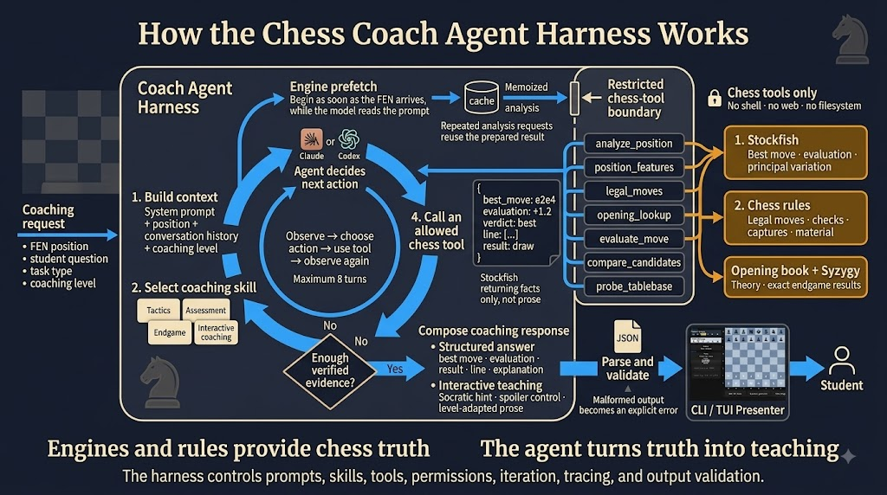
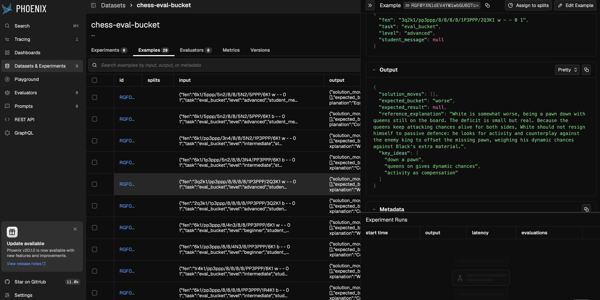
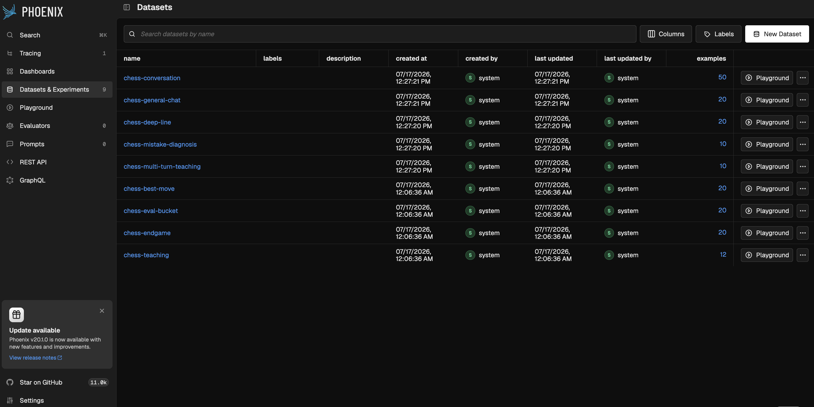

# chess-coach

An agentic chess coach for the terminal. Stockfish supplies the chess analysis;
Claude Code or Codex supplies the coaching explanation.

## Agent harness and loop



The harness turns each coaching request into a bounded, evidence-driven workflow.
It builds the model context from the position, the student's question, the task,
the conversation history, and the requested coaching level, then selects the
appropriate coaching skill.

Inside the agent loop, Claude or Codex observes the available evidence, chooses
an action, calls an allowed chess tool when needed, and evaluates the result before
deciding whether to continue. The loop is limited to eight turns, and its restricted
tool boundary exposes chess operations only—never the shell, web, or filesystem.
Engine analysis is prefetched and memoized so repeated requests for the same
position can reuse the result.

Stockfish provides evaluations and principal variations, chess rules provide legal
moves and tactical features, and the opening book and Syzygy tablebases provide
theory and exact endgame results. The agent turns those facts into level-appropriate
teaching. Finally, the harness parses and validates the structured response before
the CLI or TUI presents it to the student.

## Demo and evaluations

<video src="docs/assets/chess-coach-demo-github.mp4" controls width="100%">
  <a href="docs/assets/chess-coach-demo-github.mp4">Watch the chess coach demo</a>.
</video>


https://github.com/user-attachments/assets/f7809b0b-b0e2-495c-9a27-6ab5e6f846ca


If the embedded player is unavailable,
[watch or download the demo](docs/assets/chess-coach-demo-github.mp4).

The evaluation suite is tracked in Phoenix datasets, with individual examples
capturing the task input and expected coaching output:





## Installation

These instructions install the project from a source checkout. macOS and
Debian-based Linux are supported; on Windows, use WSL 2 and follow the Linux
instructions.

### 1. Install the system tools

You need Git, [uv](https://docs.astral.sh/uv/getting-started/installation/), and
Stockfish. `uv` installs a compatible Python version automatically (the project
requires Python 3.11 or newer).

On macOS with [Homebrew](https://brew.sh/):

```bash
brew install git uv stockfish
```

On Ubuntu, Debian, or WSL:

```bash
sudo apt-get update
sudo apt-get install -y ca-certificates curl git stockfish
curl -LsSf https://astral.sh/uv/install.sh | sh
```

Restart the terminal after installing `uv`. If Linux installed Stockfish at
`/usr/games/stockfish` but `command -v stockfish` prints nothing, set its path:

```bash
export CHESS_COACH_STOCKFISH_PATH=/usr/games/stockfish
```

Add that export to `~/.profile` to keep it for future terminal sessions.

### 2. Install the Python project

Clone or download this repository, open a terminal in its root directory, then
install the locked dependencies:

```bash
cd chess-coach
uv sync --locked
uv run chess-coach --help
```

The last command should display the available commands. All following examples
use `uv run`, so you do not need to activate the `.venv` manually.

### 3. Install one coaching provider

Choose either Claude Code or Codex. The provider writes the explanation;
Stockfish remains the source of chess truth.

For [Claude Code](https://code.claude.com/docs/en/getting-started):

```bash
curl -fsSL https://claude.ai/install.sh | bash
claude --version
```

For [Codex CLI](https://learn.chatgpt.com/docs/codex/cli):

```bash
curl -fsSL https://chatgpt.com/codex/install.sh | sh
codex --version
```

### 4. Run first-time setup

Select the provider you installed. Setup saves the choice, checks Stockfish, and
opens the provider login flow when authentication is needed:

```bash
# Choose one:
uv run chess-coach setup --provider claude
uv run chess-coach setup --provider codex
```

Confirm that both dependencies are ready:

```bash
uv run chess-coach doctor
```

`Provider auth` and `Stockfish` should both report `OK`. The configuration is
stored in `~/.config/chess-coach/config.toml` (or under `$XDG_CONFIG_HOME` when
that variable is set).

### 5. Start coaching

Launch the interactive board:

```bash
uv run chess-coach tui
```

Or start a terminal chat:

```bash
uv run chess-coach chat
```

For a one-shot explanation, pass a position as FEN:

```bash
uv run chess-coach coach \
  "rnbqkbnr/pppppppp/8/8/8/8/PPPPPPPP/RNBQKBNR w KQkq - 0 1" \
  --level beginner
```

Switch providers later with `uv run chess-coach provider use claude` or
`uv run chess-coach provider use codex`.

## Troubleshooting

- `Stockfish: FAIL`: run `command -v stockfish`. If the Linux package installed
  `/usr/games/stockfish`, set `CHESS_COACH_STOCKFISH_PATH` as shown above.
- `Provider auth: FAIL`: confirm the selected CLI is available with
  `claude --version` or `codex --version`, then run
  `uv run chess-coach provider login`.
- Wrong provider selected: run `uv run chess-coach provider status`, then switch
  it with `uv run chess-coach provider use <claude|codex>`.

## Development

Install the development dependency group plus the optional tracing packages used
by the test suite. Then install the Git hooks and run the quality checks:

```bash
uv sync --locked --extra tracing
uv run pre-commit install
uv run ruff check .
uv run ruff format --check .
uv run mypy .
uv run pytest --cov
```
